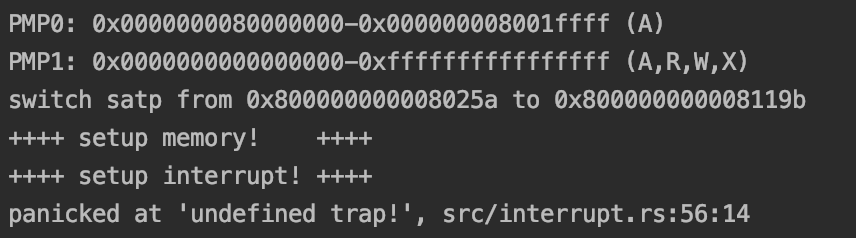

# Lab1实验报告

> 2017013640 张祎维 计71

#### 1. 回答：详细描述 rcore 中处理中断异常的流程（从异常的产生开始）。

在rocre中，相应的流程为：

1. 产生异常/中断
2. 将寄存器保存在栈上，使用中断帧(TrapFrame)的结构体来记录寄存器的值，调用`SAVE_ALL`函数保存上下文环境
3. 通过`rust_trap`函数处理相应的中断/异常，`__alltraps`函数为所有中断处理程序的入口
4. 调用`RESTORE_ALL`函数恢复上下文环境
5. 返回，继续执行原程序

#### 2. 回答：对于任何中断，`__alltraps` 中都需要保存所有寄存器吗？请说明理由。

是的。

保存和恢复某个寄存器是因为未来会被使用且当前可能被破坏；其中对于`scause`和`stval`寄存器，只是用来告知软件中断原因并进入相应的处理分支的，虽然只需要读取一次即可丢弃，但在内核的Rust代码部分需要读取这些CSR，故而还是需要保存的。

#### 3. 编程：在任意位置触发一条非法指令异常（如：mret），在 `rust_trap` 中捕获并对其进行处理（简单 `print & panic` 即可）。

非法指令修改部分在`init.rs`，如下：

```rust
unsafe {
    asm!("mret"::::"volatile");
}
```

捕获及处理结构见下图：



即在`rust_main`函数中触发非法指令`mret`，`mret`指令是用于`M`态中断返回到`S`态或`U`态，而此时在`S`态，调用即会产生异常；之后由于此异常不属于现有的几种情况，在`_`类下处理，即有`print & panic`。

